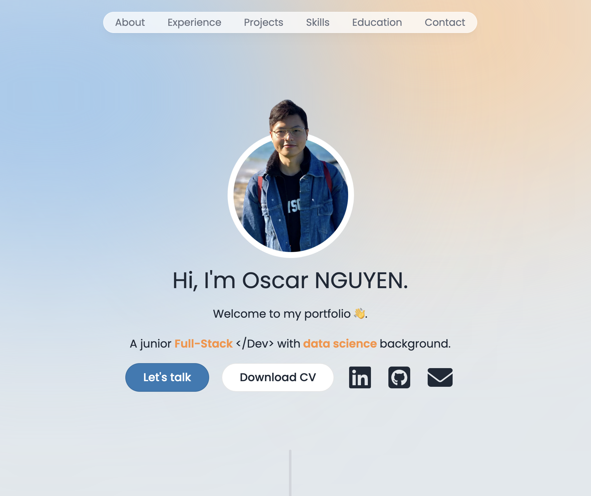

# Welcome to Oscar's Professional Portfolio

[](https://oscar-nguyen.vercel.app)

This is Oscar's professional portfolio website built with **Next.js**, **TypeScript**, **Tailwind CSS**, and **Framer Motion**. The portfolio showcases my background, skills, experiences, and completed projects in an interactive and responsive design.

The website features modern UI/UX principles with smooth animations and a fully functional contact form with email integration with Resend API.

This project serves as both a professional showcase and a demonstration of modern web development practices using React ecosystem tools.

## Demo & Snippets

- **Live Portfolio**: [https://oscar-nguyen.vercel.app](https://oscar-nguyen.vercel.app)

### Screenshots of the portfolio:

- **Hero Section**: Modern introduction with animated elements and call-to-action buttons.</br>
  


---

## Requirements / Purpose

- **MVP**: Develop a modern, responsive portfolio website to showcase professional experience, skills, and projects with an engaging user interface.
- **Purpose**: Provide a comprehensive platform for potential employers and clients to learn about my background and view my work.
- **Stack**:
  - Next.js 14 for the React framework with App Router.
  - TypeScript for type safety and better development experience.
  - Tailwind CSS for responsive design and styling.
  - Framer Motion for smooth animations and interactions.
  - Resend API for email functionality.
  - Vercel for hosting and deployment.

---

## Build Steps

1. Clone the repository:
   ```bash
   git clone https://github.com/uwerrrr/Oscar_Portfolio.git
   ```
2. Navigate to the project directory:
   ```bash
   cd Oscar_Portfolio
   ```
3. Install dependencies:
   ```bash
   npm install
   ```
4. Set up environment variables:
   ```bash
   cp .env.example .env.local
   # Add your Resend API key and other required environment variables
   ```
5. Run the development server:
   ```bash
   npm run dev
   ```
6. Open [http://localhost:3000](http://localhost:3000) in your browser to see the result.

---

## Goals / Approach

- **Main Goal**:
  Create a professional portfolio that effectively showcases skills and experience while demonstrating proficiency in modern web development technologies.
- **Design Goals**:
  - Clean, modern design with smooth animations and transitions.
  - Fully responsive layout that works across all device sizes.
  - Accessible design following WCAG guidelines.
  - Fast loading times and optimized performance.
- **Approach**: Next.js was chosen for its excellent performance, SEO capabilities, and developer experience. Tailwind CSS provides utility-first styling for rapid development, while Framer Motion adds engaging animations.

---

## Features

- **Responsive Design**: Fully responsive layout that adapts to all screen sizes and devices.
- **Interactive Sections**:
  - Hero/Intro: Animated introduction with profile picture and key information.
  - About: Detailed background information with smooth reveal animations.
  - Experience: Timeline view of work experience with hover effects.
  - Education: Timeline view of educational background with institution logos.
  - Skills: Interactive skill showcase with animation.
  - Projects: Filterable project gallery with detailed descriptions and links.
  - Contact: Functional contact form with real-time email sending.
- **Modern UI/UX**:
  - Smooth scroll navigation with active section highlighting.
  - Framer Motion animations for enhanced user experience.
  - Clean typography and consistent spacing.
  - Professional color scheme with good contrast ratios.
- **Performance Optimizations**:
  - Next.js Image component for optimized image loading.
  - Component lazy loading and code splitting.
  - Efficient bundle size with tree shaking.
- **Email Integration**: Contact form connected to Resend API for reliable email delivery.
- **SEO Optimized**: Meta tags, structured data, and proper heading hierarchy.

---

## Known Issues

- Contact form may experience delays during high traffic periods.
- Some animations may not display on older browsers without modern JavaScript support.

---

## Future Goals

- Implement dark/light theme toggle.
- Integrate with a headless CMS for easier content management.
- Add analytics to track visitor engagement.

---

## Change Logs
- [x] Migrated from static HTML/CSS to Next.js with TypeScript.
- [x] Implemented responsive design with Tailwind CSS.
- [x] Added smooth animations with Framer Motion.
- [x] Integrated functional contact form with Resend API.
- [x] Optimized images and performance for faster loading.
- [x] Added project filtering functionality.
- [x] Implemented smooth scroll navigation with active section detection.
- [x] Deployed to Vercel with continuous integration.

---

## What Did I Struggle With?

- **Animation Performance**: Initially struggled with smooth animations across different devices and screen sizes. Resolved by optimizing Framer Motion configurations and using transform properties instead of layout-shifting animations.
- **Email Integration**: Configuring the contact form with proper validation and reliable email delivery required learning Resend API and implementing proper error handling.
- **Responsive Design**: Ensuring consistent layout and typography across all device sizes, especially for the timeline and project grid components.
- **Performance Optimization**: Balancing rich animations and interactions while maintaining fast loading times and good Core Web Vitals scores.

---

## Tech Stack Details

- **Frontend**: Next.js 14, React 18, TypeScript
- **Styling**: Tailwind CSS, PostCSS
- **Animations**: Framer Motion
- **Icons**: FontAwesome, React Icons
- **Email**: Resend API, React Email Components
- **Deployment**: Vercel
- **Development**: ESLint, Node.js


